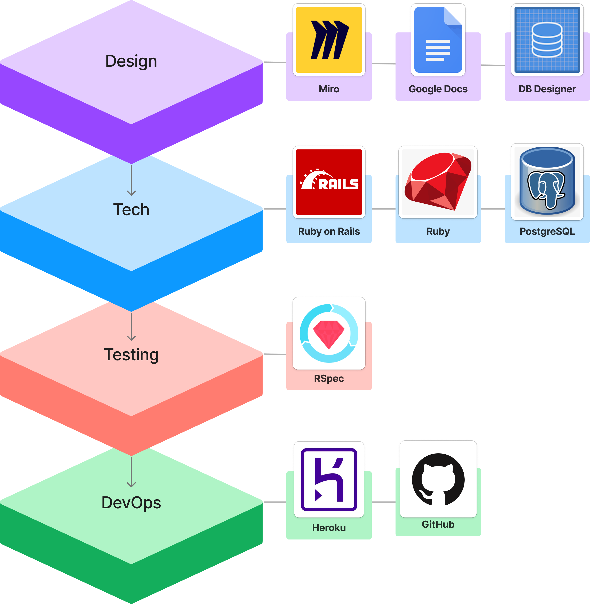
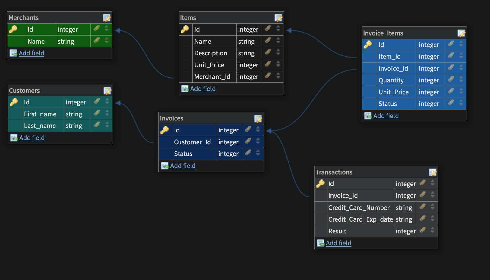

[![Contributors][contributors-shield]][contributors-url]
[![Forks][forks-shield]][forks-url]
[![Stargazers][stars-shield]][stars-url]
[![Issues][issues-shield]][issues-url]

<!-- PROJECT LOGO -->
 

  

  <h1 align="center">Little Esty Shop</h3>

  <h3 align="center">
    Little Esty E-Commerce Database
     
  </h3>

<!-- TABLE OF CONTENTS -->
<h4>
  
Table of Contents

  <ol>
    <li>
      <a href="#about-the-project">About The Project</a>
      <ul>
        <li><a href="#deployment-information">Deployment Information</a></li>
        <li><a href="#built-with">Built With</a></li>
        <li><a href="#database-schema">Database Schema</a></li>
        <li><a href="#learning-goals">Learning Goals</a></li>
      </ul>
    </li>
    <li>
      <a href="#getting-started">Getting Started</a>
      <ul>
          <li><a href="#repository-installation">Repository Installation</a></li>
          <li><a href="#gems-utilized">Gems Utilized</a></li>
      </ul>
    </li>
    <li><a href="#roadmap">Roadmap</a></li>
    <li><a href="#contact">Contact</a></li>
    <li><a href="#acknowledgments">Acknowledgments</li>
    <li><a href="#license">License</a></li></a>
  </ol>
</h4>

<!-- ABOUT THE PROJECT -->
## About The Project

"Little Esty Shop" is a group project that builds a fictitious e-commerce platform where merchants and admins can manage inventory and fulfill customer invoices. Learning goals included practice designing a normalized database schema and defining model relationships, utilizing advanced routing techniques, utilizing advanced Active Record techniques to perform complex database queries, and practice consuming a public API to apply OOP principles to organize code.

(<a href="#top">back to top</a>)

<!-- Deployment Information -->
### Deployment Information

Little Esty Shop is not currently deployed 😵

* ~~Heroku Deployment~~ 

(<a href="#top">back to top</a>)

<!-- Built With -->
### Built With

(<a href="#top">back to top</a>)

<!-- Database Schema -->
### Database Schema

(<a href="#top">back to top</a>)

<!-- Learning Goals -->
### Learning Goals

* Write migrations to create tables and relationships between tables
* Implement CRUD functionality for a resource using forms, buttons, and links, and associated view helpers (form_with, button_to, etc)
* Use MVC to organize code effectively, limiting the amount of logic included in views and controllers
* Use built-in ActiveRecord methods to join multiple tables of data, make calculations, and group data based on one or more attributes
* Write model tests that fully cover the data logic of the application
* Write feature tests that fully cover the functionality of the application

(<a href="#top">back to top</a>)

<!-- GETTING STARTED -->
## Getting Started

Little Esty Shop is a monolithic Rails application that provides simple Create, Read, Update, Delete (CRUD) functionality with a user-friendly interface to navigate between entries. Follow the steps below to get started with running the application on your local machine.

<!-- Repository Installation -->
### Repository Installation

1. Clone the repository: `git clone https://github.com/bkeener7/little-esty-shop`
1. Navigate to the cloned repository's directory: `cd little_esty_shop`
1. Install gem packages: `bundle install`
1. Setup the database: `rails db:{create,migrate,seed}`
1. Run local RSpec test suite, all tests should be passing: `bundle exec rspec`
1. Start the server: `rails s`
1. Open your web browser and navigate to `localhost:3000`. You should now see the Little Esty Shop application running locally on your machine.

<!-- Gems Utilized Installation -->
### Gems Utilized

- <b>Capybara</b>: Helps you test web applications by simulating how a real user would interact with your app.
- <b>Launchy</b>: A helper for launching cross-platform applications in a fire and forget manner.
- <b>Orderly</b>: A gem to test the order of items in a list.
- <b>Pry</b>: An IRB alternative and runtime developer console.
- <b>RSpec Rails</b>: Testing framework for Rails 3.x, 4.x, and 5.x.
- <b>Shoulda Matchers</b>: Provides RSpec- and Minitest-compatible one-liners to test common Rails functionality.
- <b>SimpleCov</b>: A code coverage analysis tool for Ruby.
- <b>Pry Rails</b>: Integrates the Pry REPL with Rails.
- <b>RuboCop Rails</b>: Rails-specific static code analysis.
- <b>RuboCop RSpec</b>: Code analyzer for RSpec files.

(<a href="#top">back to top</a>)

<!-- ROADMAP -->
## Roadmap

Stretch Goals

* Refactor test suite and models.
* Further integrate FactoryBot into testing. 

See the [open issues](https://github.com/bkeener7/little-esty-shop/issues) for a full list of proposed features (and known issues).

(<a href="#top">back to top</a>)

<!-- CONTACT -->
## Contact

<table>
  <tr>
    <td></td>
  </tr>
  <tr>
    <td>Bryan Keener</td>

  </tr>
  <tr>
    <td>
       <a href="https://github.com/bkeener7">GitHub</a> 
       <a href="https://www.linkedin.com/in/bkeener/">LinkedIn</a>
    </td>
  </tr>
</table>

(<a href="#top">back to top</a>)

<!-- ACKNOWLEDGMENTS -->
## Acknowledgments

Turing School of Software Design: [https://turing.edu/](https://turing.edu/)

(<a href="#top">back to top</a>)

<!-- LICENSE -->
## License

Distributed under the MIT License.

(<a href="#top">back to top</a>)

<!-- MARKDOWN LINKS & IMAGES -->
<!-- https://www.markdownguide.org/basic-syntax/#reference-style-links -->
[contributors-shield]: https://img.shields.io/github/contributors/bkeener7/triple_crown.svg?style=for-the-badge
[contributors-url]: https://github.com/bkeener7/little-esty-shop/graphs/contributors
[forks-shield]: https://img.shields.io/github/forks/bkeener7/triple_crown.svg?style=for-the-badge
[forks-url]: https://github.com/bkeener7/little-esty-shop/network/members
[stars-shield]: https://img.shields.io/github/stars/bkeener7/triple_crown.svg?style=for-the-badge
[stars-url]: https://github.com/bkeener7/little-esty-shop/stargazers
[issues-shield]: https://img.shields.io/github/issues/bkeener7/triple_crown.svg?style=for-the-badge
[issues-url]: https://github.com/bkeener7/little-esty-shop/issues
[license-shield]: https://img.shields.io/github/license/bkeener7/triple_crown.svg?style=for-the-badge
[license-url]: https://github.com/bkeener7/little-esty-shop/blob/master/LICENSE.txt